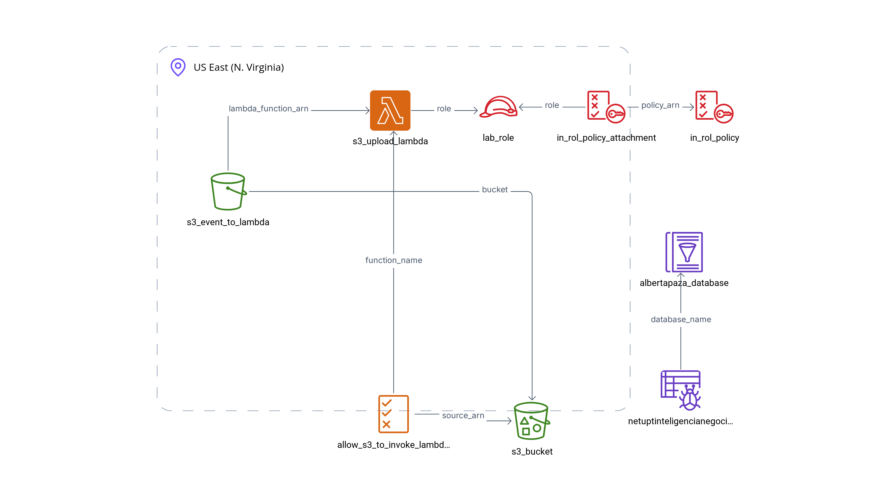
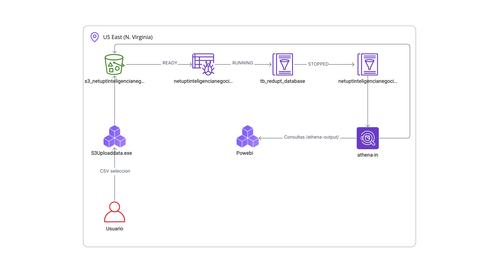

# SIMGR-UPT: Sistema de Monitoreo y Gestión de Red para Laboratorios UPT

**Descripción:**  
El **Sistema de Monitoreo y Gestión de Red para Laboratorios UPT (SIMGR-UPT)** tiene como objetivo supervisar y gestionar en tiempo real el rendimiento de la red en los laboratorios de la Universidad Privada de Tacna. Esto incluye monitoreo de ancho de banda, estabilidad de la conexión y detección de problemas para optimizar los recursos y garantizar un entorno eficiente.


## Integrantes

| Nombre                             | Código             |
|------------------------------------|-------------------|
| Escobar Rejas, Carlos Andrés       | (2021070016)       |
| Apaza Ccalle, Albert Kenyi         | (2021071075)       |
| Ricardo Cutipa Gutierrez           | (2021069827)       |
| Erick Churacutipa Blass            | (2020067578)       |
| Jesus Huallpa Maron                | (2021071085)       |


## Reporte de Power BI
📊 **Puedes acceder al reporte de Power BI haciendo clic en el siguiente enlace:**

[Ver Reporte en Power BI](https://app.powerbi.com/view?r=eyJrIjoiNjMxZDkyYjQtMDFhMy00NTdkLTlkNzYtOWExODc5MGU0YmE3IiwidCI6IjE2NzFiMjY2LTJhNDktNDYyYi05Zjk1LWU4MzFjOGRlMDRkOSIsImMiOjEwfQ%3D%3D)


## Diagramas

### 1. Construcción de la Infraestructura


### 2. Interacción del Usuario sobre lo Creado
.


## Inventario de Archivos y Carpetas

### Carpeta Raíz

1. **`data/`**  
   - Contiene los archivos de datos en formato CSV utilizados por el sistema.

2. **`G02_UPTRED.pbix`**  
   - Archivo de Power BI para análisis y visualización de datos.

3. **`lambda_function.zip`**  
   - Comprimido con los siguientes componentes:
     - `s3bucket.py`: Script para subir datos al bucket S3.
     - `datos_combinados.csv`: Archivo combinado generado desde `data`.

4. **`requirements.txt`**  
   - Dependencias necesarias para los scripts Python.

5. **`s3bucket.py`**  
   - Script que sube archivos CSV al bucket S3.

6. **`sqlcsv.py`**  
   - Combina los CSV en `data` para generar `datos_combinados.csv`.

### Carpeta PruebasExpo

1. **`APPs3uploaddata.exe`**  
   - Aplicación de escritorio en Python para subir archivos CSV al bucket S3.

2. **`final data prueba.csv`**  
   - Archivo de prueba para demostración.

3. **`s3uploaddata.py`**  
   - Código fuente de `APPs3uploaddata.exe`.

### Estructura General

```
/
├── data/
│   ├── [Archivos CSV...]
├── G02_UPTRED.pbix
├── lambda_function.zip
│   ├── s3bucket.py
│   ├── datos_combinados.csv
├── requirements.txt
├── s3bucket.py
├── sqlcsv.py
├── PruebasExpo/
│   ├── APPs3uploaddata.exe
│   ├── final data prueba.csv
│   ├── s3uploaddata.py
```

## Pasos de Automatización de Recursos

### 1. Configuración Inicial

- Asegúrate de tener los siguientes archivos en el entorno local:
  - `sqlcsv.py`
  - `s3bucket.py`
  - `requirements.txt`
  - `lambda_function.zip`
  - Carpeta `data/` con los archivos CSV.

### 2. Eliminar Recursos Existentes

Si necesitas limpiar tu entorno, sigue estos pasos:

1. Eliminar datos en el bucket S3:
   ```bash
   aws s3 rm s3://netuptinteligencianegocios --recursive
   ```

2. Eliminar crawler en AWS Glue:
   ```bash
   aws glue delete-crawler --name netuptinteligencianegocios-crawler
   ```

3. Destruir la infraestructura de AWS con Terraform:
   ```bash
   terraform destroy --auto-approve
   ```

### 3. Configuración y Generación de Recursos

1. Ubícate en la carpeta que contiene `main.tf` (Terraform).

2. Inicia Terraform:
   ```bash
   terraform init
   ```

3. Crea la infraestructura:
   ```bash
   terraform apply --auto-approve
   ```

### 4. Automatización con Scripts

1. Combina los archivos CSV de `data/` con `sqlcsv.py`:
   ```bash
   python3 sqlcsv.py
   ```

2. Sube el archivo combinado al bucket S3 con `s3bucket.py`:
   ```bash
   python3 s3bucket.py
   ```

## Configuración del Controlador ODBC para Power BI

### 1. Descargar e Instalar Controlador

- Descarga el controlador desde:  
  [Amazon Athena ODBC Driver v2.0.3.0](https://downloads.athena.us-east-1.amazonaws.com/drivers/ODBC/v2.0.3.0/Windows/AmazonAthenaODBC-2.0.3.0.msi).

### 2. Configuración del ODBC

- Abre el Administrador de ODBC (64 bits).
- Configura un nuevo DSN con los siguientes parámetros:
  - **Data Source Name**: `athena-in`
  - **Description**: `athena-in in Power BI`
  - **Region**: `us-east-1`
  - **Catalog**: `AwsDataCatalog`
  - **Database**: `default`
  - **Workgroup**: `primary`
  - **S3 Output**: `s3://netuptinteligencianegocios/athena-output/`
  - **Authentication Options**: `DEFAULT CREDENTIALS`

### 3. Probar la Conexión

- Presiona **Test** en el ODBC configurado.
- Resultado esperado:
  ```
  Successfully connected to: Athena engine version 3
  Region: us-east-1
  Catalog: AwsDataCatalog
  Workgroup: primary
  Auth Type: Default Credentials
  ```

## Carga de Datos en Power BI

1. Abre Power BI y selecciona **Obtener Datos → Amazon Athena**.
2. Configura el DSN:
   - Introduce el DSN configurado: `athena-in`.
3. Selecciona las tablas disponibles desde `AwsDataCatalog` y cárgalas en Power BI.
4. Realiza ajustes en las visualizaciones según sea necesario.

## Notas Finales

- Asegúrate de que las credenciales de AWS están configuradas antes de ejecutar los scripts.
- Antes de cargar datos en Power BI, verifica que el bucket S3 contiene los datos esperados.
- Durante la exposición, utiliza `final data prueba.csv` para las pruebas de carga en tiempo real.
